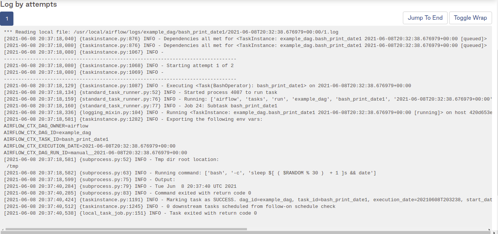

# DAG view

It contains the list of all available dags, they can be turned on/off with the toggle button

The runs show how many dags runs have been with each state
Schedule shows how often the dag runs are triggered
Last Run is the date where the schedule period began
Recent Tasks shows the status of the current or latest running dag
Actions help to trigger manually a dag, refresh the last modifications of the dag or
delete de dag, this last option won't remove the dag file, only the metadata

# Tree View
When a DAG is clicked, we land on the tree view, it shows the history and current running dag
along with the status of the tasks

# Graph View

It shows the dependencies between tasks and last status of the run

# Gantt View

It allows analyzing task durations and overlaps 

# Context menu

When clicking a task from a task instance, a context menu is displayed with several options

logs:

If the "clear" option is used on a task, it will remove its status, so when the dag
runs again, it will start from that task

"All instances" button shows the last runs of that task

