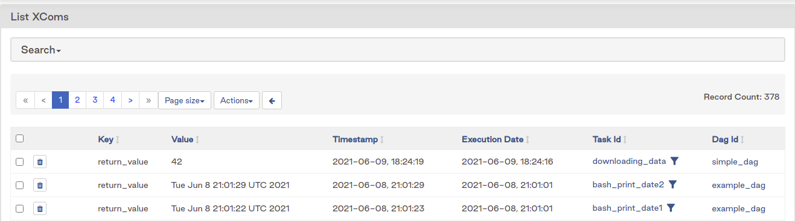

XComs helps to share small amount of data between tasks

It's used with the returning value of a function for example, and once is logged into
the metadata, it looks like this:



To access those values, we can use the inside a function the context of the dag run, for example

```python

def _push_xcoms(ti):
    ti.xcom_push(key='return_value', value=42)

def _get_xcoms(ti):
    ti.xcom_pull(key='return_value', task_ids=['my_task_id'])
```

XComs have individual size limits depending on the storage option:

* **SQLite:** 2 GB
* **Postgres:** 1 GB
* **MySQL:** 64 KB
